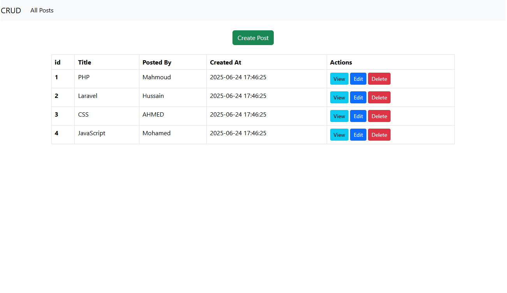
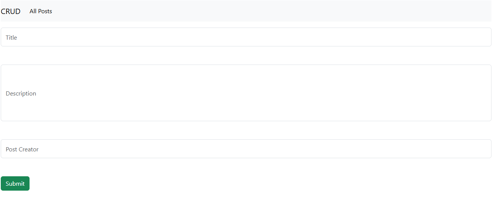
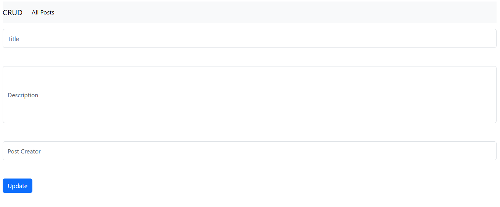
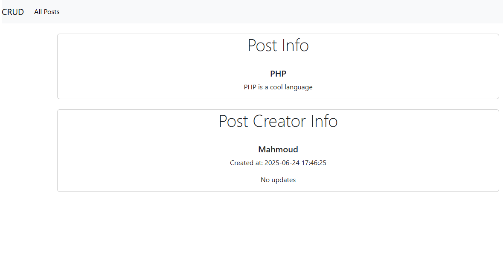

# Laravel Posts CRUD

A simple Laravel CRUD app for creating, reading, updating, and deleting blog posts.

---

## 🚀 Requirements

- PHP >= 8.x
- Composer
- MySQL or SQLite
- Node.js & npm (optional, if you use Laravel Mix)

---
## ⚙️ Installation

1. Clone the repo:

   git clone https://github.com/MahmoudYoussef959/Laravel-crud-app.git
   
   cd Laravel-crud-app

3. Install dependencies:
   
composer install

npm install

3. Configure Environment:

  Rename the .env.example file in the root directory to .env and update the necessary variables.
  mv .env.example .env

4. Generate the application key:
   php artisan key:generate

5. Set up your database:
  Create a database with the same name specified in .env (default is laravel).
  Run the SQL script found in schema.sql file in the root directory to create the required tables with appropriate schema and relations.

6. Run migrations:
   php artisan migrate

7. Serve the application
   php artisan serve

8. Visit http://localhost:8000

## 📸 Screenshots

Here’s what the app looks like:

### ✅ Posts List

### 📝 Create Post

### ✏️ Edit Post

### 👀 View Single Post

